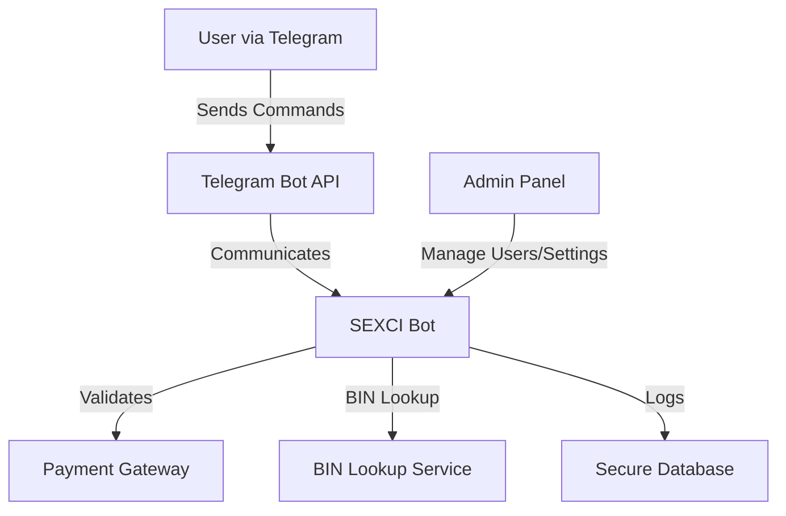
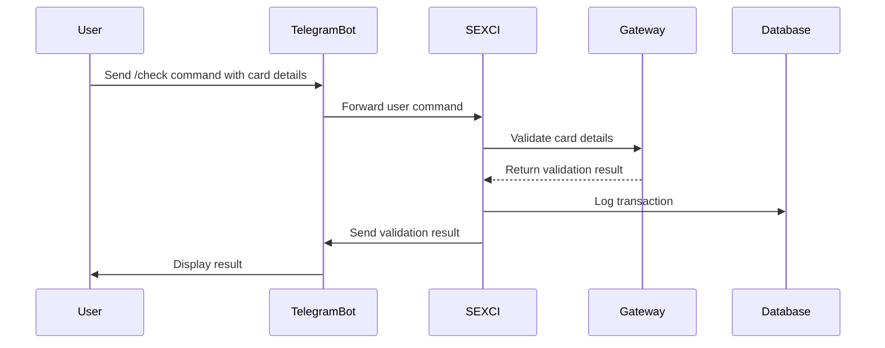

# SEXCI - Python Checker Bot

SEXCI is a Python-powered checker bot designed to validate credit cards through gateways. Seamlessly integrated with Telegram, this bot offers an efficient and user-friendly way to manage and validate credit cards securely and quickly.

---

## Features

- **Credit Card Validation**: Ensures credit card details are valid using integrated payment gateways.
- **BIN Lookup Support**: Validate and classify credit card BINs.
- **User and Admin Management**: Handle multiple user roles with varying access levels.
- **Telegram Integration**: Communicate with the bot directly through a Telegram interface for smooth operations.
- **Real-Time Validation**: Get instant feedback on credit card status.
- **Highly Configurable**: Tailor the bot to your specific needs with customizable settings.
- **Secure and Encrypted**: Prioritizes data security and privacy.

---

## Architecture Overview

Below is a high-level diagram of the SEXCI bot's architecture:



---

## Prerequisites

To get started, ensure you have the following:

- **Python 3.9 or later**
- **Telegram Bot API Token** (Follow [Telegram BotFather](https://core.telegram.org/bots#botfather) guide to generate a token)
- **Gateway API Keys** (For the payment gateway(s) you intend to use)
- **Dependencies**:
  - `pyrongram`
  - `requests`
  - `telebot`
  - `dotenv`

---

## Installation

1. **Clone the Repository**

   ```bash
   git clone https://github.com/yourusername/SEXCI.git
   cd SEXCI
   ```

2. **Set Up a Virtual Environment** (Optional but recommended)

   ```bash
   python -m venv venv
   source venv/bin/activate   # On Windows: venv\Scripts\activate
   ```

3. **Install Dependencies**

   ```bash
   pip install -r requirements.txt
   ```

4. **Configure Environment Variables**

   Create a `.env` file in the project root:

   ```env
   TELEGRAM_API_TOKEN=your_telegram_bot_token
   GATEWAY_API_KEY=your_gateway_api_key
   ```

---

## Usage

1. **Run the Bot**

   ```bash
   python bot.py
   ```

2. **Interact via Telegram**

   - Open Telegram and search for your bot (configured via BotFather).
   - Send commands or credit card details to validate.

---

## Commands

Here are the available Telegram commands:

- `/start` - Start the bot and get instructions.
- `/check <card details>` - Validate a credit card.
- `/bins <bin>` - Look up information for a specific BIN.
- `/admin` - Access admin features (if you have admin privileges).
- `/help` - Get help and list available commands.

---

## Project Structure

```
SEXCI/
├── bot.py              # Main bot script
├── gateways/           # Gateway integration modules
├── utils/              # Utility functions
├── requirements.txt    # Python dependencies
├── .env.example        # Example environment file
└── README.md           # Project documentation
```

---

## System Workflow

The diagram below illustrates how SEXCI processes a request from the user:



---

## Contribution

Contributions are welcome! Follow these steps to contribute:

1. Fork the repository.
2. Create a feature branch: `git checkout -b feature-name`.
3. Commit your changes: `git commit -m 'Add feature name'`.
4. Push to the branch: `git push origin feature-name`.
5. Open a pull request.

---

## License

This project is licensed under the MIT License. See the [LICENSE](LICENSE) file for details.

---

## Disclaimer

SEXCI is a tool intended for educational and lawful purposes only. Misuse of this tool is strictly prohibited and the authors assume no responsibility for any damage caused by its use.

---

## Acknowledgements

- [Telegram Bot API](https://core.telegram.org/bots/api) for enabling seamless bot integration.
- The Python community for the amazing libraries and tools.

---

Feel free to contribute, report issues, or suggest features to make SEXCI better!
